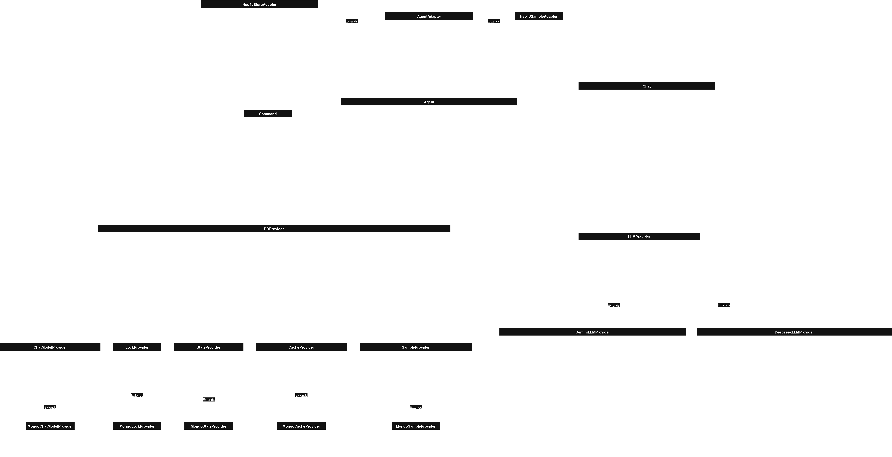

# rag_cmd
A Pythonic way to define precise RAG commands for smarter LLMs.

## Setup
You need to have `Python >= 3.11` installed on your system and a running Neo4J database.\
Install the `rag_cmd` CLI with `pip` inside the repository.\
The `-e` option enables local code changes for the functionality of the CLI.
```bash
pip3 install -e .
```

## Usage
### API
You can start the API with the following command:
```bash
rag_cmd api
```

### CLI
You can list all available chats with `ls`:
```bash
rag_cmd chats ls
```

To create a new chat you can use the `create` command:
```bash
rag_cmd chats create --llm-type gemini
```

When you want to send messages and read messages in a chat, you can use the `connect` command:
```bash
rag_cmd chats connect --id <id>
```

### Docker
You can use docker compose to spin up a database deployment and the rag_cmd api:
```bash
docker compose up
```
If you want to use the cli inside docker, you can use the following command:
```bash
docker compose exec rag_cmd rag_cmd chats debug --llm-type GEMINI
```

## UML
### Classdiagram


## Sequencediagram

